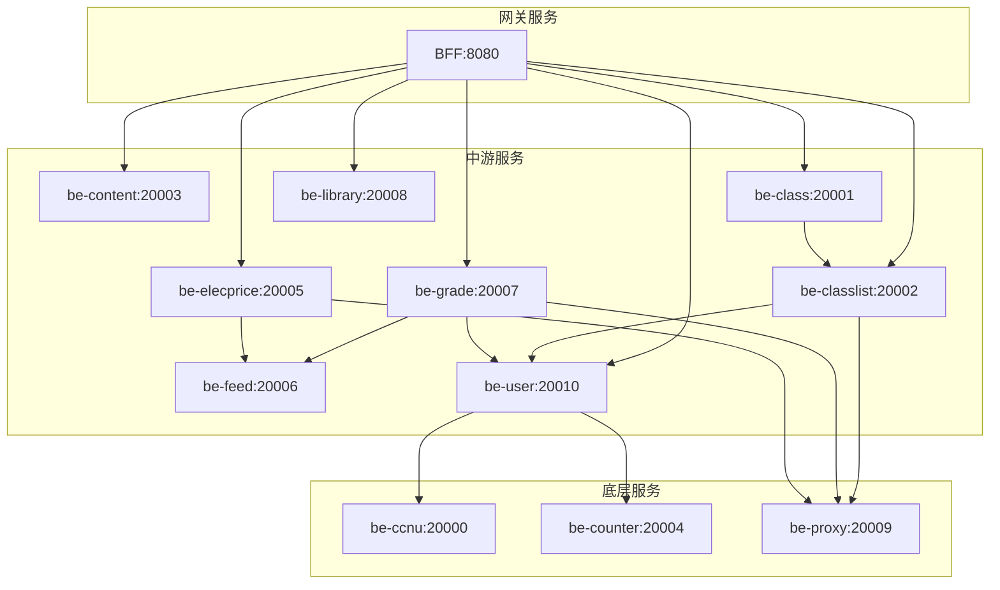

# 华师匣子后端

华师匣子后端是一个基于 Go 的微服务架构项目，为华师匣子应用提供后端支持。

## 项目特性

- **微服务架构**：12 个独立服务，解耦设计
- **服务注册与发现**：基于 etcd 的服务治理
- **日志追踪**：集成 OpenTelemetry，支持分布式追踪
- **多协议支持**：同时支持 gRPC 和 HTTP
- **消息队列**：Kafka 实现异步消息处理
- **搜索能力**：Elasticsearch 提供全文搜索支持

## 技术栈

| 组件 | 版本 | 用途 |
|------|------|------|
| Go | 1.26+ | 开发语言 |
| etcd | latest | 服务注册与发现 |
| MySQL | latest | 数据存储 |
| Redis | latest | 缓存与分布式锁 |
| Kafka | latest | 消息队列 |
| Elasticsearch | 7.17.23 | 搜索引擎 |

## 目录结构

```
ccnubox-be/
├── bff/                  # BFF 层，聚合后端服务
├── common/               # 公共定义，protobuf 文件
├── be-content/           # 内容服务
├── be-ccnu/              # CCNU 一站式登录
├── be-class/             # 课程服务（统一架构版本）
├── be-classlist/         # 课表服务
├── be-counter/           # 核心用户判断
├── be-elecprice/         # 电费服务
├── be-feed/              # 消息推送服务
├── be-grade/             # 成绩服务
├── be-user/              # 用户服务
├── be-proxy/             # IP 代理池
└── be-library/           # 图书馆服务
```

## 服务说明

| 服务 | 端口 | 说明 |
|------|------|------|
| bff | 8080 | BFF 层，聚合服务给前端 |
| be-content | 20003 | 校历、部门、信息汇总、banner |
| be-ccnu | 20000 | 一站式登录服务 |
| be-class | 18000/20001 | 蹭课、空闲教室查询（18000 为 HTTP） |
| be-classlist | 20002 | 课表管理 |
| be-counter | 20004 | 核心用户判断 |
| be-elecprice | 20005 | 电费查询 |
| be-feed | 20006 | 消息推送 |
| be-grade | 20007 | 成绩查询 |
| be-user | 20010 | 用户服务，提供 cookie |
| be-library | 20008 | 图书馆服务 |
| be-proxy | 20009 | IP 代理池 |

端口取自 Nacos 生产配置（`grpc` 段），监控指标端口为 gRPC 端口 + 1000。

## 快速开始

### 环境要求

- Go 1.26+
- Docker & Docker Compose

### 部署与配置

运行时配置统一由 Nacos 管理：生产环境读取 PROD 组配置，测试环境读取 PREV 组配置；本地调试请参考各服务目录中的 README 和配置示例。镜像构建、环境部署与生产发布的完整流程见 [CI/CD 发布流程](#cicd-发布流程)。

## CI/CD 发布流程

代码从合并到上线分为两步：合并到 `main` 自动部署到测试环境，再通过推送 `promote-*` tag 将版本发布到生产环境。工作流定义在 `.github/workflows/` 下。

### 合并即部署（测试环境）

push 到 `main` 且变更命中服务代码、`common/**` 或 [deploy.yaml](.github/workflows/deploy.yaml) 时，[Build and Deploy](.github/workflows/deploy.yaml) 工作流会：

1. 构建受影响服务的镜像并推送到阿里云 ACR（tag 为 commit SHA 前 7 位）；
2. SSH 到部署服务器，在 `~/ccnubox-preview`（测试环境 Compose 项目）拉取新镜像并更新服务。

测试环境与生产环境同机部署但相互隔离：容器名带 `-preview` 后缀、运行在独立的 bridge 子网中、etcd 注册隔离到 `test/*` 命名空间、读取 Nacos PREV 组配置，BFF 对外暴露 `:8081`。该流程不会触碰生产环境。

### Promote 发布（生产环境）

生产环境的更新由 [promote.yaml](.github/workflows/promote.yaml) 工作流负责，推送 `promote-*` tag（如 `promote-20260907`）触发，tag 需推送到官方仓库：

```bash
TAG="promote-$(date +%Y%m%d)"
git tag "$TAG"
git push origin "$TAG"
```

工作流 SSH 到部署服务器，与部署流程共用远端锁保证互斥，然后：

1. 读取 `~/ccnubox-preview/.env` 中全部 12 个服务的镜像版本号；
2. 逐键同步到生产环境 `~/ccnubox_v3/.env`（只更新版本号键，其余内容保持不变；版本无变化时直接结束）；
3. 在生产环境执行 `docker compose pull && docker compose up -d` 完成版本切换，并清理 24 小时前的旧镜像。

生产镜像不会在 promote 流程中重新构建——镜像在合并流程已构建推送完毕，promote 只做版本切换。

## 架构图


```mermaid
graph TD
    subgraph TopService ["网关服务"]
        bff_node["BFF:8080"]
    end

    subgraph MidService ["中游服务"]
        be_content["be-content:20003"]
        be_course["be-class:20001"]
        be_course_list["be-classlist:20002"]
        be_grade["be-grade:20007"]
        be_elecprice["be-elecprice:20005"]
        be_feed["be-feed:20006"]
        be_user["be-user:20010"]
        be_library["be-library:20008"]
    end

    subgraph BotService ["底层服务"]
        be_ccnu["be-ccnu:20000"]
        be_counter["be-counter:20004"]
        be_proxy["be-proxy:20009"]
    end

    bff_node --> be_content
    bff_node --> be_course
    bff_node --> be_course_list
    bff_node --> be_grade
    bff_node --> be_elecprice
    bff_node --> be_user
    bff_node --> be_library

    be_course --> be_course_list
    be_course_list --> be_user
    be_course_list --> be_proxy

    be_grade --> be_feed
    be_grade --> be_user
    be_grade --> be_proxy

    be_elecprice --> be_feed
    be_elecprice --> be_proxy

    be_user --> be_ccnu
    be_user --> be_counter
```

## 配置说明

服务运行配置按服务维护，基础设施配置示例由根目录统一维护：

| 文件 | 说明 |
|------|------|
| `<服务>/config/config-example.yaml` | 各服务运行配置示例 |
| `/config-infra-example.yaml` | 所有服务共用的基础组件配置示例 |

### 配置示例（config-example.yaml）

```yaml
env: "prod"

server:
  name: "服务名"
  grpc:
    addr: "0.0.0.0:端口"
    timeout: 10s

data:
  database:
    source: "用户名:密码@tcp(主机:端口)/数据库?charset=utf8mb4&parseTime=True&loc=Local"
  redis:
    addr: "主机:6379"
    password: "密码"
  kafka:
    brokers:
      - "主机:9092"

registry:
  etcd:
    addr: "主机:2379"
    username: "用户名"
    password: "密码"

log:
  path: "/logs/app.log"
  maxSize: 100
  maxBackups: 7
  maxAge: 30
  compress: 1
```

## 开发指南

### 添加新服务

1. 在根目录创建服务目录
2. 编写 Dockerfile（参考现有服务）
3. 添加服务自己的 config-example.yaml；基础设施配置沿用根目录 config-infra-example.yaml
4. 将服务接入 CI/CD 链路，四处列表缺一不可，否则会出现不触发、构建被跳过或部署失败：
   - `.github/workflows/deploy.yaml` 顶层的变更检测 `paths`
   - `.github/workflows/deploy.yaml` 中 `changes` job 的 `all_services` 数组
   - `.github/workflows/deploy.yaml` 中 deploy job 远端的服务白名单（`case` 校验，未登记会报 `Invalid service`）
   - [promote.yaml](.github/workflows/promote.yaml) 中的版本同步 `services` 数组
5. 在 Nacos 中添加对应的运行时配置
6. 更新本 README 的服务说明

### 本地调试

```bash
# 进入服务目录
cd be-class

# 下载依赖
go mod tidy

# 运行服务
go run .
```

## API 文档

API 文档位于 [bff/docs/](bff/docs/)

## 常见问题

**Q: 服务启动失败怎么办？**
A: 检查 etcd、MySQL、Redis 是否正常运行，确保配置正确。

**Q: 如何查看日志？**
A: 日志挂载在 `/logs` 目录，容器内查看：`docker exec -it <container> tail -f /logs/app.log`

**Q: 如何添加新的 API？**
A: 在 common/ 目录下修改 protobuf 定义，重新生成代码后更新对应服务。
